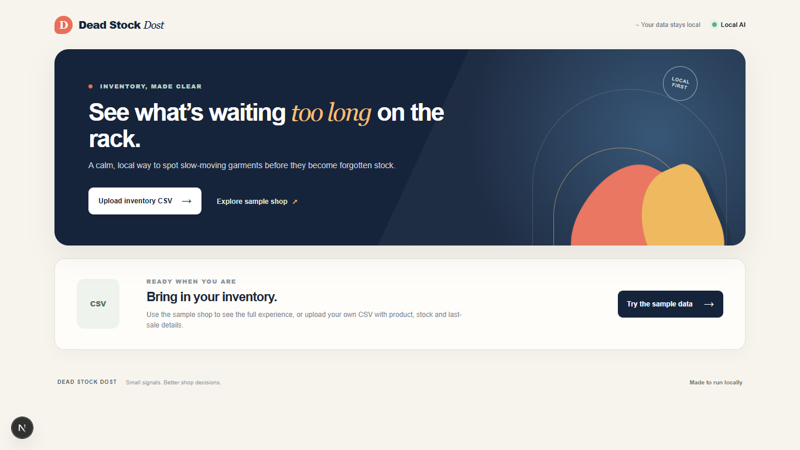
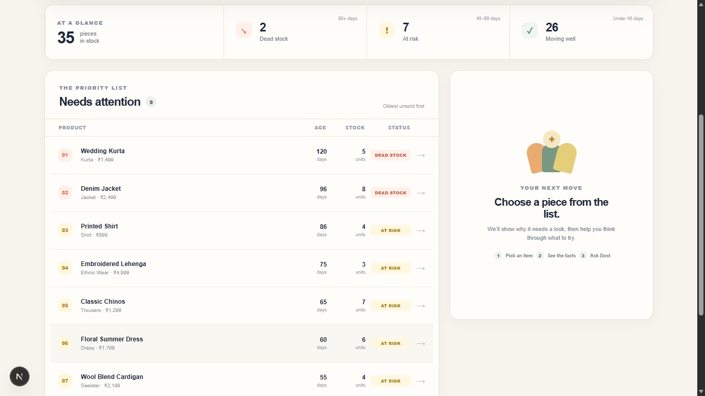

# Dead Stock Dost

> **A tiny local-first AI tool that helps small garment shops find stock that's getting stuck.**

Dead Stock Dost is one of the five projects built for the **Hacktoberfest Weekend Challenge: Build for a Friend (DEV Challenges)**.

It is designed for a small neighborhood garment shop with a simple inventory CSV and one practical question:

> **Which products need attention, and what could I try?**

**CSV → Identify Dead Stock → Explain → Suggest an Action**

> **The code calculates the facts. The AI explains the facts. The shopkeeper decides.**

## 📸 Screenshots

### Homepage



### Stock Report



## ✨ What It Does

Upload an inventory CSV to:

- Parse and validate inventory data
- Identify **Dead Stock** and **At Risk** products
- Show products that need attention, with older unsold products first
- Select a product and ask:
  - **Why is this stuck?**
  - **What can I try?**
- Get short, practical suggestions from a **local AI**

The core inventory analysis works without AI. If Ollama isn't available, you can still upload the CSV and see which products need attention.

## 🧠 How Dead Stock Is Determined

Dead-stock classification is completely deterministic. **AI does not decide the status.**

| Days since last sale | Status |
|---|---|
| 90+ days | 🔴 **DEAD STOCK** |
| 45–89 days | 🟡 **AT RISK** |
| Less than 45 days | 🟢 **NORMAL** |
| Stock ≤ 0 | Ignored |

Only products with stock greater than zero are considered.

## 🤖 Local AI

When you select a product, Dead Stock Dost can send its calculated facts and your question to a **local open-weight model running through Ollama**.

The AI can explain the situation and suggest two or three possible actions based only on the available inventory data.

It does **not**:

- Change inventory
- Set prices or discounts
- Make decisions for the shopkeeper
- Invent facts that aren't present in the data

The CSV remains the **source of truth**.

## 🛠️ Tech Stack

- Next.js
- React
- TypeScript
- CSV
- Ollama
- Local open-weight AI model

The MVP does not require a database, authentication system, cloud AI, or hosted backend.

## 📄 CSV Format

Dead Stock Dost expects these columns:

```text
name
category
price
stock
last_sale_date
```

Example:

```csv
name,category,price,stock,last_sale_date
Wedding Kurta,Kurta,1499,5,2026-04-02
Blue Shirt,Shirt,899,8,2026-06-10
Denim Jacket,Jacket,1999,8,2026-03-28
```

Dates should use `YYYY-MM-DD`.

Invalid rows are reported clearly rather than silently discarded or guessed.

## 🚀 Run Locally

### Requirements

- Node.js 20.9+
- Ollama for local AI suggestions

### Install

```bash
npm install
```

### Start the development server

```bash
npm run dev
```

Then open:

```text
http://localhost:3000
```

You can use the demo data or upload your own CSV.

### Set Up Ollama

Install Ollama, then:

```bash
ollama pull llama3.2
ollama serve
```

If Ollama isn't available, the inventory analysis still works; only the AI suggestions become unavailable.

## 🧪 Try the Demo

The intended demo takes **less than two minutes**:

```text
Open the app
   ↓
Try demo data / Upload CSV
   ↓
See products needing attention
   ↓
Select a product
   ↓
"Why is this stuck?"
   ↓
"What can I try?"
   ↓
Get a local AI response
```

## 📚 Documentation

- [Architecture](docs/ARCHITECTURE.md) — how the application works
- [Scope](docs/SCOPE.md) — what the MVP includes and intentionally leaves out

## 🤝 Built for Hacktoberfest

Dead Stock Dost was built for the **Hacktoberfest Weekend Challenge: Build for a Friend**.

The goal is simple: build something useful for a real person without turning it into an over-engineered platform.

For this project, that person is a small garment-shop owner who needs a quick way to notice inventory that's been sitting around for too long.

> **The code calculates.  
> The AI explains.  
> The shopkeeper decides.**